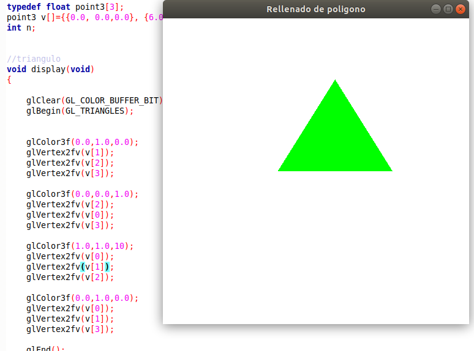

# Segundo laboratorio de Computación Grafica - CS UNSA 2019

Alumno:
- Jair Francesco Huaman Canqui
- CUI: 20152567

Profesor: 
- Dr. Juan Carlos Gutierrez Caceres

Para compilar el programa usar el .sh
```
sh compile.sh
```

Luego ejecute con

```
./lab2
```

# 1. Mover la camara con el Mouse

## Movimiento usando el rastro del mouse


## Movimiento pulsando un click


# 2. Dotar al programa de una tecla que permita cambiar el modo de proyección entre ORTOGONAL y PERSPECTIVA
Para cambiar de modo de proyección usar la tecla F7, es un switch entre ambos modos


```
case GLUT_KEY_F7:
    if(MiCamara->camProjection == CAM_CONIC){
        MiCamara->x1=-3;
        MiCamara->x2=3;
        MiCamara->y1=-3;
        MiCamara->y2=3;
        MiCamara->z1=-5;
        MiCamara->z2=5;
        MiCamara->camProjection = CAM_PARALLEL;
    } else MiCamara->camProjection = CAM_CONIC;
    break;
```


# 3. Mover el objeto en la proyeccion (con las teclas)


# 4. Programar otros modos de movimiento de cámara como son el MODO PAN o el MODO TRÍPODE




