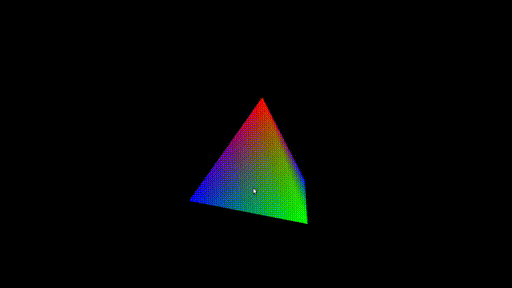
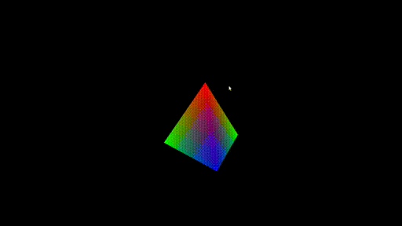
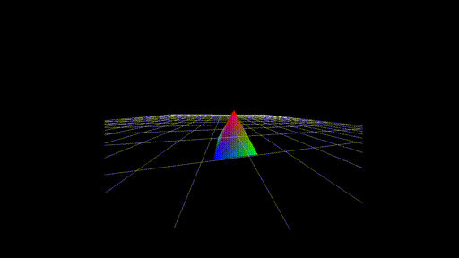
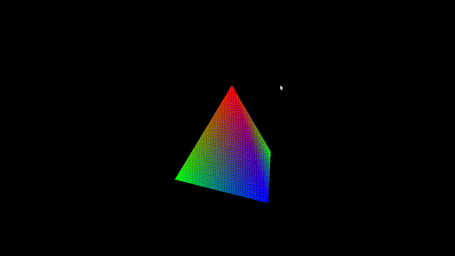

# Segundo laboratorio de Computación Grafica - CS UNSA 2019

Alumno:
- Jair Francesco Huaman Canqui
- CUI: 20152567

Profesor: 
- Dr. Juan Carlos Gutierrez Caceres

Para compilar el programa usar el .sh
```
sh compile.sh
```

Luego ejecute con

```
./lab2
```

# 1. Mover la camara con el Mouse

## Movimiento usando el rastro del mouse



### Código

```
static void SpecialKey(int key, int x, int y) {
	case GLUT_KEY_F2:
	    glutPassiveMotionFunc(Examinar);
	    MiCamara->camMovimiento = CAM_EXAMINAR;
	    printf("%s\n","F2, CAM_EXAMINAR" );
	    break;

/* La función Examinar(int x, int y) moverá la cámara en el 
modo Examinar según los movimientos del ratón: */
void Examinar(int x, int y) {
    float rot_x, rot_y;
    rot_y = (float) (old_y - y);
    rot_x = (float) (x - old_x);
    MiCamara->Rotar_Latitud( rot_y * DEGREE_TO_RAD);
    MiCamara->Rotar_Longitud(rot_x * DEGREE_TO_RAD);
    old_y = y;
    old_x = x;
    glutPostRedisplay();
}
```


## Movimiento pulsando un click


### Código

```
En la función SpecialKey:
case GLUT_KEY_F3:
    glutPassiveMotionFunc(MouseMotion);
    MiCamara->camMovimiento = CAM_PASEAR;
    printf("%s\n","F3,CAM PASEAR" );
    break;

En La función Mouse:
case CAM_PASEAR:
    if (state == GLUT_DOWN)
        glutMotionFunc(Andar);
    if (state == GLUT_UP)
        glutMotionFunc(NULL);
    break;

void Andar(int x, int y) {
    float rotacion_x, avance_y;
    avance_y = (float) (y - old_y) / 10;
    rotacion_x = (float) (old_x - x) * DEGREE_TO_RAD / 5;
    MiCamara->YawCamera(rotacion_x);
    MiCamara->AvanceFreeCamera(avance_y);
    old_y = y;
    old_x = x;
    glutPostRedisplay();
}
```

# 2. Dotar al programa de una tecla que permita cambiar el modo de proyección entre ORTOGONAL y PERSPECTIVA
Para cambiar de modo de proyección usar la tecla F7, es un switch entre ambos modos


```
case GLUT_KEY_F7:
    if(MiCamara->camProjection == CAM_CONIC){
        MiCamara->x1=-3;
        MiCamara->x2=3;
        MiCamara->y1=-3;
        MiCamara->y2=3;
        MiCamara->z1=-5;
        MiCamara->z2=5;
        MiCamara->camProjection = CAM_PARALLEL;
    } else MiCamara->camProjection = CAM_CONIC;
    break;
```


# 3. Mover el objeto en la proyeccion (con las teclas)

```
case GLUT_KEY_PAGE_UP:
    if (MiCamara->camAperture < 175 * DEGREE_TO_RAD)
        MiCamara->camAperture = MiCamara->camAperture + 2.5f * DEGREE_TO_RAD;
    break;

case GLUT_KEY_PAGE_DOWN:
    if (MiCamara->camAperture > 5 * DEGREE_TO_RAD)
        MiCamara->camAperture = MiCamara->camAperture - 2.5f * DEGREE_TO_RAD;
    break;

case GLUT_KEY_UP:
    MiCamara->Rotar_Latitud( 2.5f * DEGREE_TO_RAD);
    break;

case GLUT_KEY_DOWN:
    MiCamara->Rotar_Latitud( -2.5f * DEGREE_TO_RAD);
    break;

case GLUT_KEY_LEFT:
    MiCamara->Rotar_Longitud( -2.5f * DEGREE_TO_RAD);
    break;

case GLUT_KEY_RIGHT:
    MiCamara->Rotar_Longitud(2.5f * DEGREE_TO_RAD);
    break;
```




# 4. Programar otros modos de movimiento de cámara como son el MODO PAN o el MODO TRÍPODE


Modo TRIPODE:
```
void Tripode(int x, int y){
    float rotacion_x, rotacion_y;
    rotacion_x = (float)(old_x - x) * DEGREE_TO_RAD / 5;
    rotacion_y = (float)(old_y - y) * DEGREE_TO_RAD / 5;
    MiCamara->YawCamera(rotacion_x);
    MiCamara->PitchCamera(rotacion_y);
    old_y = y;
    old_x = x;
    glutPostRedisplay();
}
```

Modo PAN
```
void Pan(int x, int y){
    float avance_x, avance_y;
    avance_x = (float)(old_x - x) / 10;
    avance_y = (float)(y - old_y) / 10;
    MiCamara->PanCamera(avance_x, avance_y);
    old_y = y;
    old_x = x;
    glutPostRedisplay();
}

```
