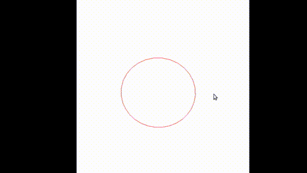

# Primera laboratorio de Computación Grafica - CS 2019

Alumno:
- Jair Francesco Huaman Canqui

Profesor: 
- Dr. Juan Carlos Gutierrez Caceres

Requerimientos:
- OpenGL

```
$ sudo apt-get update
$ sudo apt-get install libglu1-mesa-dev freeglut3-dev mesa-common-dev
```

# 1.Graficar Recta 2D usando punto medio


# 2.Graficar Circunferencia o poligono 


# 3.Traslación, Rotación y Escala de un poligono



# 5.Pintar


