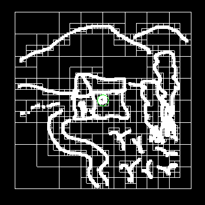

# Segundo laboratorio de Computación Grafica - CS UNSA 2019

Alumno:
- Jair Francesco Huaman Canqui
- CUI: 20152567

Profesor: 
- Dr. Juan Carlos Gutierrez Caceres

Para compilar el programa usar el .sh
```
sh compile.sh
```

Luego ejecute con

```
./curvabezier
./quad
```

# 1. Curva de Bézier

## Tres puntos


## Cinco puntos


### Código

# 2. Quad Tree


